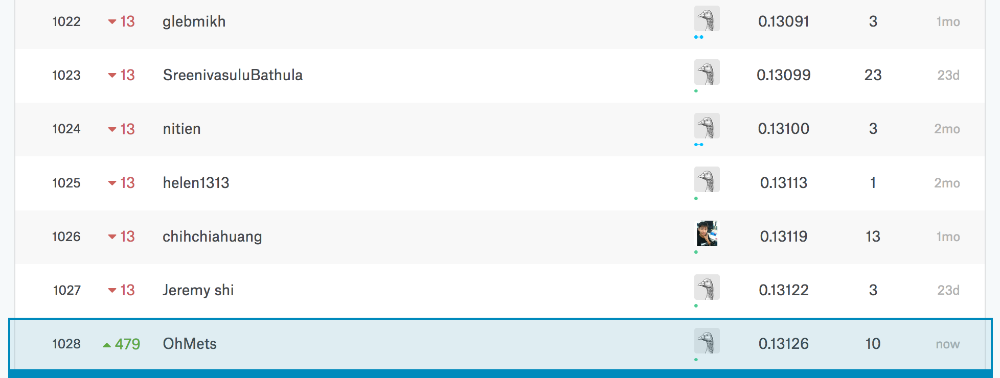

# Kaggle - House Prices: Advanced Regression Techniques - Part 2

This Final Exam/Project relies on the Kaggle.com [House Prices: Advanced Regression Techniques competition](https://www.kaggle.com/c/house-prices-advanced-regression-techniques). 

In part one we will demonstrate acumen by completing some requested calculations.   In part two we will create a regression model and submit to the Kaggle competition. 

## Environment Prep

```{r, warning=FALSE, message=FALSE}
if (!require('car')) install.packages('car')
if (!require('ggplot2')) install.packages('ggplot2')
if (!require('plyr')) install.packages('plyr')
if (!require('stats')) install.packages('stats')
if (!require('MASS')) install.packages('MASS')
if (!require('boot')) install.packages('boot')
if (!require('GGally')) install.packages('GGally')
if (!require('caret')) install.packages('caret')
if (!require('Boruta')) install.packages('Boruta')
```

## Data Import

```{r}
train <- read.csv('train.csv', stringsAsFactors = FALSE)
test <- read.csv('test.csv', stringsAsFactors = FALSE)
testlabel <- test$Id
trainlabel <- train$Id
#summary(train)
```

## Modeling  

_Build some type of regression model and submit your model to the competition board.  Provide your complete model summary and results with analysis.  Report your Kaggle.com  user name and score._

### Data Preparation

#### Use BoxCox From Pt1 on Dependant Variable

```{r}
Ylambda <- 0.1
Y.transformed <- yjPower(train$SalePrice, Ylambda)
train$SalePrice <- Y.transformed
dependant <- train$SalePrice

#we'll use this later to transform back
reverseBox <- function(predictions) {
    (Ylambda * predictions + 1) ^ (1 / Ylambda) - 1
}
```

#### Combine for Cleaning

```{r}
test$SalePrice <- 0
test$FlagVar <- 1
train$FlagVar <- 0
cleanMe <- rbind(train, test)
```

#### Feature Removal 1:  Near Zero Variance

```{r}
removeNoVar <- function(df) {
    if (length(nearZeroVar(df)) > 0) {
      df <- df[, -nearZeroVar(df)] 
    }
}

cleanMe <- removeNoVar(cleanMe)
```

#### NA Hunting

##### NA Checker Function

```{r}
NAcheck <- function(df){
    index <- sapply(df,function(x)sum(is.na(x)))
    newdf <- data.frame(index = names(df),Missing_Values=index)
    newdf[newdf$Missing_Values > 0,]
} 
NAcheck(cleanMe)
```


##### Separate by Type

```{r}
cleanMe_num <- cleanMe[, sapply(cleanMe, is.numeric)]
cleanMe_cat <- cleanMe[, sapply(cleanMe, is.character)]
```

##### Categorical:  Replace NA w/ None

```{r}
NAcheck(cleanMe_cat)

ReplaceWithNone <- function(df) {
    df[is.na(df)] <- "None"
    df[sapply(df, is.character)] <- lapply(df[sapply(df, is.character)], as.factor)
    df
}

cleanMe_cat <- ReplaceWithNone(cleanMe_cat)
```

##### Numeric:  Selectively Update NAs

```{r}
NAcheck(cleanMe_num)

#let's impute with the means here
cleanMe_num$GarageYrBlt[is.na(cleanMe_num$GarageYrBlt)] <- mean(cleanMe_num$GarageYrBlt, na.rm=TRUE)

#otherwise, 0s
cleanMe_num[is.na(cleanMe_num)] <- 0
```

##### Feature Removal 2:  Remove Multicolinear

```{r}
review <- subset(cleanMe_num, select = -c(Id, SalePrice))
ggcorr(review)
review.cor <- cor(review)
high.cor <- findCorrelation(review.cor, cutoff=.80)
removeMe <- names(review[high.cor])[2:3]
removeMe <- c(removeMe, "TotRmsAbvGrd") #Let's keep GrLivArea and remove a different option
removeMe

myvars <- names(cleanMe_num) %in% removeMe
cleanMe_num <- cleanMe_num[!myvars]
```


##### Reassemble

```{r}
cleanMe <- cbind(cleanMe_cat, cleanMe_num)
NAcheck(cleanMe)
train <- cleanMe[cleanMe$FlagVar == 0, ]
test <- cleanMe[cleanMe$FlagVar == 1, ]
test <- subset(test, select = -c(FlagVar, SalePrice))
train <- subset(train, select = -c(FlagVar))

### clean
rm(cleanMe, cleanMe_cat, cleanMe_num, review, review.cor)
```
### Feature Selection Using Boruta Algorithm

#### Boruta Feature Selection

```{r, cache=TRUE}
set.seed(121)
bor.results <- Boruta(subset(train, select = -c(SalePrice)),
                      train$SalePrice,
                      maxRuns=101,
                      doTrace=0)
```

#### Review and Plot Results

```{r}
boruta.train <- TentativeRoughFix(bor.results)

plot(boruta.train, xlab = "", xaxt = "n")
lz<-lapply(1:ncol(boruta.train$ImpHistory),function(i)
boruta.train$ImpHistory[is.finite(boruta.train$ImpHistory[,i]),i])
names(lz) <- colnames(boruta.train$ImpHistory)
Labels <- sort(sapply(lz,median))
axis(side = 1,las=2,labels = names(Labels), at = 1:ncol(boruta.train$ImpHistory), cex.axis = 0.7)

```

#### Feature Removal 3: Subset for Final Training

```{r}
keepMe <- getSelectedAttributes(boruta.train, withTentative = F)

myvars_train <- names(train) %in% keepMe
myvars_test <- names(test) %in% keepMe

train <- train[myvars_train]
train$SalePrice <- dependant 

test <- test[myvars_test]
test$Id <- testlabel
```

### Caret: Train and Compare Linear Regression Models

```{r, warning=FALSE, message=FALSE}
set.seed(121)
#10 fold cross validation repeated 3 times
my_contrl <- trainControl(method = "repeatedcv", 
                       number = 10, 
                       repeats = 3,
                       returnResamp = "all")

#train and compare different multivariate linear regression models
#we used BoxCox to transform our dependant variable, we will use the 
#caret preprocessing function to transform others with center/scale
lmModel <- train(SalePrice ~ ., data = train, 
               method = "lm", 
               metric = "RMSE",
               preProc = c("center", "scale"),
               trControl=my_contrl)

plsModel <- train(SalePrice ~ ., data = train, 
               method = "pls", 
               metric = "RMSE",
               preProc = c("center", "scale"),
               trControl=my_contrl)

glmModel <- train(SalePrice ~ ., data = train,
               method = "glm", 
               metric = "RMSE",
               preProcess = c("center", "scale"),
               trControl = my_contrl)

glmnetModel <- train(SalePrice ~ ., data = train,
               method = "glmnet", 
               metric = "RMSE",
               preProcess = c("center", "scale"),
               trControl = my_contrl)

model_list <- list(LM = lmModel, 
                   PLS = plsModel, 
                   GLM = glmModel, 
                   GLMNET = glmnetModel)

mod_resamples <- resamples(model_list)
print(summary(mod_resamples))
```

#### StepAIC Algorithm

```{r, message=FALSE, warning=FALSE, cache=TRUE}
#for our step AIC, we won't repeat - just 10 fold CV
steptrain <- trainControl(method = "cv", 
                          number = 10,
                          returnResamp = "all")

model3 <- train(SalePrice ~ ., data = train,
               method = "lmStepAIC", 
               metric = "RMSE",
               preProcess = c("center", "scale"),
               trControl = steptrain, 
               selectionFunction= "best",
               trace=0)

model3$results
```

#### Model Review

```{r}
# This method for extracting and plotting the most important coefficients in the chosen model 
# is taken liberally from:  https://www.kaggle.com/jimthompson/regularized-linear-models-in-r

coef <- data.frame(coef.name = 
                       dimnames(coef(glmnetModel$finalModel, 
                                     s=glmnetModel$bestTune$lambda))[[1]], 
                   coef.value = 
                       matrix(coef(glmnetModel$finalModel, 
                                   s=glmnetModel$bestTune$lambda)))
coef <- coef[-1,]
coef <- arrange(coef,-coef.value)
# Just grab the most important 
imp_coef <- rbind(head(coef,10),
                  tail(coef,10))
ggplot(imp_coef) +
    geom_bar(aes(x=reorder(coef.name,coef.value),y=coef.value),
             stat="identity") +
    coord_flip() +
    ggtitle("Most Important Coefficents in the GLMNET Model") +
    theme(axis.title=element_blank(), plot.title=element_text(hjust=0.5))
```

### Kaggle Submission 

#### Make Predictions Using Best Model

```{r, warning=FALSE, message=FALSE}
myPred <- predict(glmnetModel, newdata = test)

# reverse BoxCox Transformation
myPred <- reverseBox(myPred)

submit <- data.frame(Id = test$Id, SalePrice = myPred)
write.csv(submit, file = "my_submission.csv",  row.names = FALSE)
```

#### Kaggle Score

Username: [OhMets](https://www.kaggle.com/ohmets)</br>
Best Score: 0.13126



## Summary

This was a good learning experience on preparing a dataset for linear regression using R and caret.   In this dataset, NA values were a particular challenge, as an NA didn't necessarily represent something missing, it was often instead "Not Applicable".  In particular, I never really did come up with a good solution for managing dummy variables for non-ordinal categorical variables that had NAs. 

Feature engineering and major transformation stayed out of scope, although the nudge in Pt1 on Box Cox transformations sparked some pretty important realizations.   By transforming our dependant variable, we saw some nice improvements in most of our models. 

As a noob, I relied pretty heavily on automated feature selection functions.   It was very cool to find the Boruta and StepAIC algorithms.  I understand how these are likely to be abused and can lead to overfitting, but they provided a good starting point for a beginner still peering with wonder and puzzlement at the steps and workflow necessary for training and testing predictive models.  

## References

* https://briatte.github.io/ggcorr/
* http://www.statmethods.net/stats/regression.html
* http://machinelearningmastery.com/feature-selection-with-the-caret-r-package/
* https://www.kaggle.com/ashishdutt/ahoy-all-relevant-guests-on-board-let-s-sail
* http://www.statmethods.net/management/subset.html
* http://rstudio-pubs-static.s3.amazonaws.com/256459_5a62c0ca6d5849af92607011bb6c3e1d.html
* https://sites.ualberta.ca/~lkgray/uploads/7/3/6/2/7362679/slides_-_multiplelinearregressionaic.pdf
* https://www.kaggle.com/jimthompson/regularized-linear-models-in-r
* https://www.analyticsvidhya.com/blog/2016/03/select-important-variables-boruta-package/
* https://stats.stackexchange.com/questions/20836/algorithms-for-automatic-model-selection

