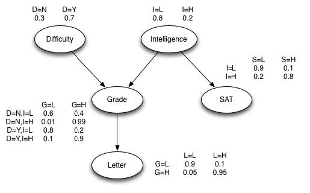

# Problem Set 1

Your colleague either commutes by train or by the bus. 20 days of the month, she takes the train and the remaining 10 days she takes the bus. If she takes the train, she reaches work on time with a probability of 0.9. If she takes the bus, she frequently gets stuck in traffic and reaches work on time with a probability of 0.5. Given that she was on time today, what is the probability that she took the bus to work today?

```{r}
bayes <- function(p_G_A, pA, p_G_B, pB){
    (p_G_A * pA) / (p_G_A * pA + p_G_B * pB)
}

bayes(.5, 1/3, .9, 2/3)
```

# Problem Set 2

```{r, warning=FALSE, message=FALSE}
library('gRain', 'Rgraphviz')
```

In the Grade Network that we looked at in the notes, what happens to the probability of Difficulty of Course when you present the evidence that the received recommendation letter was good? In addition, now present the evidence that both SAT scores were good and the letter of recommendation was good, What is the probability of the Difficulty of Course now? You should use the gRain package in R to build your network and perform these calculations. 

<center></center>

### Build Network

```{r}
# def level lists
ny <- c("no", "yes")
lh <- c("low", "high")

# def nodes
d <- cptable(~difficulty, 
             values=c(0.3, 0.7), 
             levels=ny)
i <- cptable(~intelligence, 
             values=c(0.8, 0.2), 
             levels=lh)
s_G_i <- cptable(~sat|intelligence, 
                 values=c(0.9, 0.1, 0.2, 0.8), 
                 levels=lh)
g_G_d.i <- cptable(~grade|difficulty:intelligence, 
                 values=c(0.6, 0.4, 0.8, 0.2, 0.1, 0.99, 0.1, 0.9), 
                 levels=lh)
l_G_g <- cptable(~letter|grade, 
                 values=c(0.9, 0.1, 0.5, 0.95), 
                 levels=lh)

#compile into graph
gnet <- grain(compileCPT(list(d, i, s_G_i, g_G_d.i, l_G_g)))
```

### Plot Network

```{r}
plot(gnet)
```

### Observe Initial State

```{r}
querygrain(gnet)
```

### Query: P(d | l=="high")

```{r}
l_high <- setFinding(gnet, nodes="letter", states="high")
querygrain(l_high)
```

### Query: P(d | l=="high", s=="high")

```{r}
s_high_l_high <- setFinding(gnet, nodes=c("sat", "letter"), states=c("high", "high"))
querygrain(s_high_l_high)
```

# References
* https://cran.r-project.org/web/packages/gRain/vignettes/gRain-intro.pdf
* http://people.math.aau.dk/~sorenh/misc/2014-useR-GMBN/bayesnet-slides.pdf
* http://bioconductor.org/packages/release/bioc/html/Rgraphviz.html
