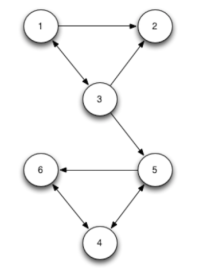

# Playing with PageRank

You'll verify for yourself that PageRank works by performing calculations on a small universe of web pages. Let's use the 6 page universe that we had in the course notes. For this directed graph, perform the following calculations in R.

<center></center>

### Environment Prep

```{r, warning=FALSE, message=FALSE}
if (!require('matrixcalc')) install.packages('matrixcalc')
if (!require('igraph')) install.packages('igraph')
```

Form the A matrix. Then, introduce decay and form the B matrix as we did in
the course notes.

```{r}
p1 <- c(0, 1/2, 1/2, 0, 0, 0)
p2 <- rep(1/6, 6) # we adjust this from 0 so that we have an equal prob to land on any page;   if we leave at 0 (indicating there are no outgoing links from p2), our page rank will not converge because of a 'dangling node'
p3 <- c(1/3, 1/3, 0, 0, 1/3, 0)
p4 <- c(0, 0, 0, 0, 1/2, 1/2)
p5 <- c(0, 0, 0, 1/2, 0, 1/2)
p6 <- c(0, 0, 0, 1, 0, 0)
A <- matrix(c(p1, p2, p3, p4, p5, p6), 6)

#confirm that the total probability for each col = 1
colSums(A)

#Introduce decay
B <- 0.85 * A + 0.15/nrow(A)
```

### Power Iteration 

Start with a uniform rank vector r and perform power iterations on B till convergence. That is, compute the solution $r = B^{n} * r$. Attempt this for a sufficiently large n so that r actually converges.

```{r}
r <- rep(1/nrow(A), nrow(A))
cbind(matrix.power(B, 10) %*% r,
      matrix.power(B, 20) %*% r,
      matrix.power(B, 30) %*% r,
      matrix.power(B, 40) %*% r,
      matrix.power(B, 50) %*% r )

PR1 <- matrix.power(B, 40) %*% r # convergence has occured by 40 iterations
```

### Eigen-Decomposition

Compute the eigen-decomposition of B and verify that you indeed get an eigenvalue of 1 as the largest eigenvalue and that its corresponding eigenvector is the same vector that you obtained in the previous power iteration method. Further, this eigenvector has all positive entries and it sums to 1.

```{r, warning=FALSE}
decomp <- eigen(B)
PR2 <- as.numeric(decomp$vectors[,which.max(decomp$values)]) #get vectors associated with largest eigenvalue == 1
PR2 <- (1/sum(PR2))*PR2 #normalize
```

### Igraph Library 

Use the graph package in R and its page.rank method to compute the Page Rank of the graph as given in A. Note that you don't need to apply decay. The package starts with a connected graph and applies decay internally. Verify that you do get the same PageRank vector as the two approaches above.

```{r, message=FALSE}
p2_0 <- rep(0, 6) ## since this library handles weighting, can put back in the 0 col;   it doesn't matter which we do, 1/6 or 0, but the graph here has the relationships we would expect, where as 1/6 does not
A_0 <- matrix(c(p1, p2_0, p3, p4, p5, p6), 6)
a <- graph.adjacency(t(A_0), weighted=TRUE, mode='directed')
ceb <- cluster_edge_betweenness(a)
plot(ceb, a) 
PR3 <- page.rank(a)$vector
```

### Comparing Results from the 3 Page Rank methods

```{r}
results <- cbind(PR1, PR2, PR3)
results <- rbind(results, colSums(results))
colnames(results) <- c('PowerIteration', 'EigenDecomp', 'IgraphLibrary')
rownames(results) <- c('p1', 'p2', 'p3', 'p4', 'p5', 'p6', 'colSum')
knitr::kable(results)
```

### References:

* https://fenix.tecnico.ulisboa.pt/downloadFile/3779573643166/google.pdf
* http://kateto.net/networks-r-igraph
* http://stackoverflow.com/questions/41107328/pagerank-in-r-issue-with-vectors-and-how-to-iterate-through-adjacency-matrix
